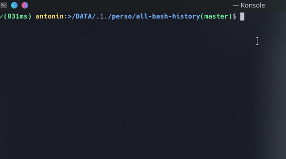

# Interactive CD Bash History

This is a fork of djoot/all-bash-history. It uses only the acd_func.sh file, tweaked to become interactive. djoot's solution is simply printing the output, so you had to issue the command again with the correct number.

## Make it work

I've placed the file to my ~ foler, and appended the block bellow to my `~/.bashrc` (rename the file to your convenience)
```bash
if [ -f ~/acd_func.sh]; then
    . ~/acd_func.sh
fi
```

Then, simply use you `cd` command like before (don't forget to `source ~/.bashrc` to apply your changes!):

`cd -` to go back to the previous directory;
`cd --` to issue the interactive prompt, and then input the desired number
`cd -n` to go back to the nth directory, if you know what number it has. e.g.: go back to where you were 3 directory before: `cd -3`.

## Examples

Interactive history:
```shell
antonin:~$ cd --
0  ~
1  ~/Downloads/test
2  ~/Downloads
Chose your path index: _
```

Direct manipulation:
```shell
antonin:~$ cd -2
antonin:~/Downloads$ _
```

The tool in action:


